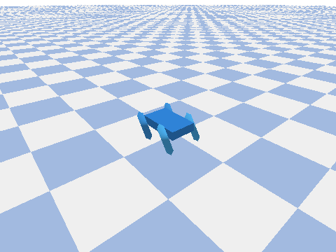

# Creature Lab

[](https://github.com/iodriller/Creature-Lab/actions/workflows/ci.yml)


Creature Lab is a tiny local lab for designing, running, diagnosing, and improving
modular robot-creatures from JSON.



Run a creature, watch it move, score the episode, diagnose failures, evolve better
versions, and replay or export the result.

## Quickstart

```bash
uv sync --extra sim --extra viz
uv run creature-lab demo --no-hold
```

`demo --no-hold` runs the built-in quadruped in the browser viewer, saves a trace under
`runs/`, and exits. Omit `--no-hold` when you want the viewer to keep looping.

## Next Steps

Browse the built-in Creature Zoo:

```bash
uv run creature-lab zoo list
uv run creature-lab zoo run quadruped
uv run creature-lab report latest
```

Improve a creature with the local evolution loop:

```bash
uv run creature-lab evolve examples/quadruped.json --task examples/crawl_forward.json --attempts 20
```

Replay or export a saved run:

```bash
uv run creature-lab view runs/<run-id>
uv run creature-lab view latest
uv sync --extra sim --extra export
uv run creature-lab export latest --gif demo.gif
```

## What You Get

- A curated Creature Zoo: quadruped, worm, hexapod, tripod, damaged quadruped, and humanoids.
- Portable JSON specs for creatures and tasks.
- Physics runs saved as replayable traces with metadata, hashes, scores, contacts, and warnings.
- Local improvement loops: `evolve` for search and `ask --offline` for validated design edits.
- Replay, diagnosis, GIF/MP4 export, and advanced backend/export bridges.

## Core Workflow

```text
CreatureSpec + TaskSpec
  -> run a physics episode
  -> save an EpisodeTrace
  -> inspect or diagnose the result
  -> evolve or edit the creature
  -> replay/export the best run
```

The durable rule:

> Every creature is JSON. Every task is JSON. Every episode is a trace. Every simulator is an adapter.

PyBullet is the default simulator. Specs, tasks, traces, and replays are portable; exact
physics behavior is backend-dependent.

## Docs

- [Getting Started](docs/GETTING_STARTED.md) - the shortest path from clone to first run.
- [Concepts](docs/CONCEPTS.md) - creatures, tasks, traces, backends, and the improve loop.
- [Creature Spec](docs/CREATURE_SPEC.md) - the JSON shape for body graphs and motors.
- [Task Spec](docs/TASK_SPEC.md) - worlds, rewards, targets, damage, and push events.
- [Run Artifacts](docs/RUN_ARTIFACTS.md) - what is saved under `runs/<run-id>/`.
- [Zoo](docs/ZOO.md) - bundled creatures, tasks, baselines, and challenge pack.
- [CLI Reference](docs/CLI_REFERENCE.md) - commands grouped by workflow.
- [Roadmap](docs/ROADMAP.md) - MVP status and future product priorities.
- [Improvement Plan (2026 H2)](docs/IMPROVEMENT_PLAN_2026.md) - report upgrade and next feature phases.
- [Archived plans](docs/archive/) - historical planning and audit notes.

## Advanced

These features are available, but they are not needed for the first run:

| Need | Command or API |
| --- | --- |
| Pre-flight validation | `uv run creature-lab validate examples/tripod.json --task examples/crawl_forward.json` |
| Diagnose why a run failed | `uv run creature-lab diagnose runs/<run-id>` |
| Write a run report | `uv run creature-lab report latest --out report.md` / `--html report.html` |
| Benchmark the zoo | `uv run creature-lab bench --zoo --task crawl_forward --attempts 3 --out runs/bench.json` |
| Export JSON schemas | `uv run creature-lab schema creature --out docs/schemas/creature.schema.json` |
| Build local zoo gallery cards | `uv run creature-lab gallery build --zoo --out docs/assets/zoo --no-media` |
| Ask for validated design edits | `uv run creature-lab ask "make it crawl farther" examples/tripod.json --task examples/crawl_forward.json --offline` |
| Generate new creature specs | `uv run creature-lab scaffold worm --out worm.json --segments 6` |
| Compare or plot runs | `uv run creature-lab compare runs/<a> runs/<b> --html diff.html` / `uv run creature-lab plot runs/<run-id>` |
| Check robustness / cross-backend gap | `uv run creature-lab robustness runs/<id> --trials 10` / `uv run creature-lab sim2sim runs/<id>` |
| MuJoCo backend | `uv sync --extra mujoco`, then `uv run creature-lab run ... --backend mujoco` |
| URDF/MJCF bridge | `export-urdf`, `export-mjcf`, and `import-urdf` |
| Gymnasium-style control | `creature_lab.env.CreatureEnv` |
| Online LLM mode | `uv sync --extra llm`, then run `ask` without `--offline` |

Install everything with:

```bash
uv sync --all-extras
```

## Testing

```bash
uv sync --all-extras
uv run ruff check .
uv run ruff format --check .
uv run pytest
```

CI runs Ruff, Pytest, `doctor`, and `validate --task` with the test-exercised extras installed.

## Development Principle

Do not build a PyBullet project. Build a backend-agnostic creature lab where PyBullet is only
the first backend.
